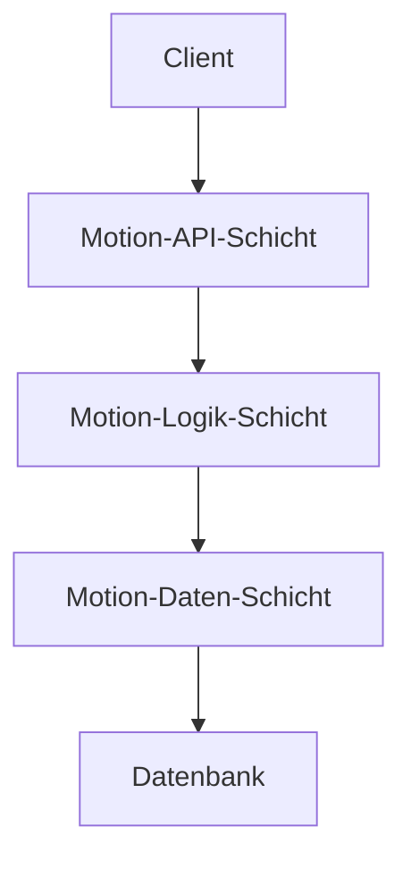

# Layer-basiertes Charakter-Motion-System

## Systemübersicht

Das Layer-basierte Charakter-Motion-System implementiert eine dreischichtige Architektur zur Verwaltung und Steuerung von Charakterbewegungen in verteilten Systemen. Diese Architektur ermöglicht eine klare Trennung von Zuständigkeiten und verbessert die Wartbarkeit sowie Erweiterbarkeit des Systems.

## Architekturschichten

### 1. Motion-API-Schicht (Präsentationsschicht)

Die API-Schicht dient als primäre Schnittstelle für externe Systeme und implementiert:

- REST-konforme Endpunkte für Bewegungssteuerung
- WebSocket-Verbindungen für Echtzeitaktualisierungen
- Validierung eingehender Befehle
- Transformation von Bewegungsdaten in das interne Format

### 2. Motion-Logik-Schicht (Geschäftslogik)

Die Logik-Schicht verarbeitet alle Bewegungsberechnungen und enthält:

- Bewegungsinterpolation für flüssige Übergänge
- Kollisionserkennung und -vermeidung
- Physikalische Berechnungen
- Zustandsverwaltung der Charaktere
- Event-System für Bewegungsereignisse

### 3. Motion-Daten-Schicht (Persistenzschicht)

Die Daten-Schicht ist verantwortlich für:

- Persistierung von Bewegungsdaten
- Caching häufig verwendeter Bewegungsmuster
- Versionierung von Bewegungsabläufen
- Datenkonsistenz und -integrität
- Optimierte Abfragen für Bewegungsinformationen

## Vorteile der Architektur

1. **Skalierbarkeit**
   - Horizontale Skalierung einzelner Schichten
   - Lastverteilung nach Bedarf
   - Unabhängige Ressourcenzuweisung

2. **Wartbarkeit**
   - Klare Trennung der Zuständigkeiten
   - Vereinfachte Fehleranalyse
   - Modularer Aufbau für einfache Updates

3. **Erweiterbarkeit**
   - Einfache Integration neuer Bewegungsmuster
   - Flexible Anpassung an verschiedene Clients
   - Modulare Erweiterung der Funktionalität

4. **Performance**
   - Optimierte Datenzugriffe
   - Effizientes Caching
   - Reduzierte Netzwerklast

## Technische Implementierung

Die Implementierung erfolgt unter Berücksichtigung folgender Aspekte:

### Kommunikationsprotokolle

- REST für administrative Aufgaben
- WebSocket für Echtzeitkommunikation
- gRPC für Interschicht-Kommunikation

### Datenformate

- JSON für API-Kommunikation
- Protocol Buffers für interne Kommunikation
- Binary für optimierte Bewegungsdaten

## Sicherheitsaspekte

- Authentifizierung über JWT
- Verschlüsselte Kommunikation
- Rate Limiting
- Input Validation

## Performance-Optimierung

- Caching-Strategien
- Lazy Loading
- Bulk Operations
- Indexierung von Bewegungsdaten

## Monitoring und Logging

- Distributed Tracing
- Performance Metrics
- Error Tracking
- Audit Logging