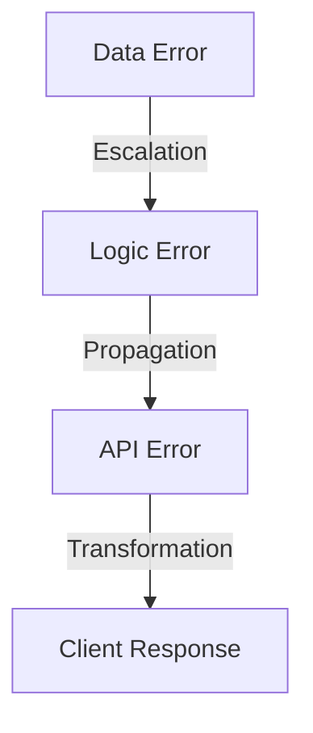
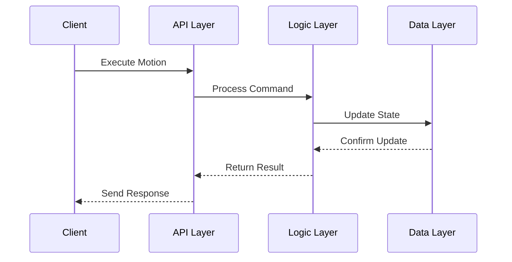

# Schichten-Diagramm des Motion-Systems

## Architekturübersicht
```mermaid
classDiagram
    %% Interfaces mit Pseudo-Namespaces
    class "api.IMotionAPI" {
        <<interface>>
        +executeMotion(MotionCommand)
        +queryMotionState(EntityId)
        +streamMotionUpdates(EntityId)
        +registerMotionHandler(Handler)
    }

    class "logic.IMotionLogic" {
        <<interface>>
        +processMotion(MotionData)
        +calculateNextState(EntityState)
        +validateMotion(MotionRequest)
        +handleCollision(CollisionEvent)
    }

    class "data.IMotionData" {
        <<interface>>
        +saveMotionState(EntityState)
        +loadMotionPattern(PatternId)
        +queryEntityHistory(EntityId)
        +updateEntityState(EntityId, State)
    }

    %% Implementierungen der Schichten
    class "api.MotionAPILayer" {
        -logicLayer: logic.IMotionLogic
        +handleRequest(Request)
        +validateInput(Input)
        +transformResponse(Response)
    }

    class "logic.MotionLogicLayer" {
        -dataLayer: data.IMotionData
        +executeBusinessLogic(Command)
        +processPhysics(State)
        +handleEvents(Event)
    }

    class "data.MotionDataLayer" {
        +persistData(Data)
        +loadData(Query)
        +manageCache(CacheOperation)
    }

    %% Vererbungsbeziehungen
    "api.MotionAPILayer" ..|> "api.IMotionAPI"
    "logic.MotionLogicLayer" ..|> "logic.IMotionLogic"
    "data.MotionDataLayer" ..|> "data.IMotionData"
    
    %% Abhängigkeiten zwischen Schichten
    "api.MotionAPILayer" --> "logic.IMotionLogic"
    "logic.MotionLogicLayer" --> "data.IMotionData"

    %% Datenmodelle
    class "model.MotionCommand" {
        +entityId: string
        +motionType: MotionType
        +parameters: MotionParameters
        +timestamp: DateTime
    }

    class "model.EntityState" {
        +id: string
        +position: Vector3D
        +velocity: Vector3D
        +orientation: Quaternion
        +motionState: State
    }

    class "model.MotionPattern" {
        +id: string
        +sequence: MotionSequence[]
        +constraints: MotionConstraints
        +metadata: PatternMetadata
    }

    %% Datenmodellbeziehungen
    "api.MotionAPILayer" ..> "model.MotionCommand"
    "logic.MotionLogicLayer" ..> "model.EntityState"
    "data.MotionDataLayer" ..> "model.MotionPattern"
```

## Schnittstellenbeschreibung

### IMotionAPI
Die API-Schnittstelle definiert die externe Kommunikation:
- `executeMotion`: Führt ein Bewegungskommando aus
- `queryMotionState`: Fragt den aktuellen Zustand einer Entität ab
- `streamMotionUpdates`: Streamt Zustandsänderungen
- `registerMotionHandler`: Registriert Event-Handler

### IMotionLogic
Die Logik-Schnittstelle verarbeitet Bewegungsdaten:
- `processMotion`: Verarbeitet Bewegungskommandos
- `calculateNextState`: Berechnet den nächsten Zustand
- `validateMotion`: Validiert Bewegungsanfragen
- `handleCollision`: Behandelt Kollisionsereignisse

### IMotionData
Die Daten-Schnittstelle verwaltet die Persistenz:
- `saveMotionState`: Speichert Bewegungszustände
- `loadMotionPattern`: Lädt Bewegungsmuster
- `queryEntityHistory`: Fragt Bewegungshistorie ab
- `updateEntityState`: Aktualisiert Entitätszustände

## Datenstrukturen

### MotionCommand
```typescript
interface MotionCommand {
    entityId: string;
    motionType: MotionType;
    parameters: MotionParameters;
    timestamp: DateTime;
}
```

### EntityState
```typescript
interface EntityState {
    id: string;
    position: Vector3D;
    velocity: Vector3D;
    orientation: Quaternion;
    motionState: State;
}
```

### MotionPattern
```typescript
interface MotionPattern {
    id: string;
    sequence: MotionSequence[];
    constraints: MotionConstraints;
    metadata: PatternMetadata;
}
```

## Komponenteninteraktion

1. Client → API-Schicht
   - REST/WebSocket-Anfragen
   - Bewegungskommandos
   - Zustandsabfragen

2. API → Logik-Schicht
   - Validierte Kommandos
   - Transformierte Daten
   - Event-Weiterleitungen

3. Logik → Daten-Schicht
   - Zustandsänderungen
   - Persistenzanfragen
   - Datenabfragen

## Fehlerbehandlung

Jede Schicht implementiert spezifische Fehlerbehandlung:



## Sequenzfluss


