# Demo-MotionSystem-Diagramm

## Übersicht

Dieses Dokument beschreibt das Layer-basierte Charakter-Motion-System und seine Komponenten. Es enthält Diagramme, die die Struktur und das Verhalten des Systems veranschaulichen, sowie detaillierte Erklärungen der Abläufe.

## Klassendiagramm

```mermaid
classDiagram
    class com.example.motion.demo.LayerSwitchingDemo {
        +main(String[] args)
        +demonstrateLayerSwitching(ICharacterMotionService, UUID, BasicWalkingLayer, AdvancedWalkingLayer)
    }
    class com.example.motion.demo.MotionSystemDemo {
        +main(String[] args)
        +createSampleAnimations(IMotionDataRepository)
        +demonstrateMotionSequence(ICharacterMotionService, UUID)
    }
    class com.example.motion.services.CharacterMotionServiceImpl {
        +addMotionLayer(IMotionLayer, int)
        +removeMotionLayer(IMotionLayer)
        +updateLayerPriority(IMotionLayer, int)
        +getActiveLayers()
        +playAnimation(UUID, String, float)
        +setMovementDirection(UUID, Direction, float)
        +stopMotion(UUID)
        +registerMotionCallback(UUID, MotionCallback)
        +getMotionState(UUID)
    }
    class com.example.motion.services.ICharacterMotionService {
        <<interface>>
        +addMotionLayer(IMotionLayer, int)
        +removeMotionLayer(IMotionLayer)
        +updateLayerPriority(IMotionLayer, int)
        +getActiveLayers()
        +playAnimation(UUID, String, float)
        +setMovementDirection(UUID, Direction, float)
        +stopMotion(UUID)
        +registerMotionCallback(UUID, MotionCallback)
        +getMotionState(UUID)
    }
    class com.example.motion.sys.behavior.AdvancedWalkingLayer {
        +setGaitType(UUID, GaitType)
        +processMotion(UUID, MotionState, float)
        +checkCollision(UUID, MotionState)
        +processPhysics(UUID, PhysicsData)
        +validateMotionState(MotionState)
        +interpolateStates(MotionState, MotionState, float)
    }
    class com.example.motion.sys.behavior.BasicWalkingLayer {
        +processMotion(UUID, MotionState, float)
        +checkCollision(UUID, MotionState)
        +processPhysics(UUID, PhysicsData)
        +validateMotionState(MotionState)
        +interpolateStates(MotionState, MotionState, float)
    }
    class com.example.motion.sys.behavior.IdleLayer {
        +processMotion(UUID, MotionState, float)
        +checkCollision(UUID, MotionState)
        +processPhysics(UUID, PhysicsData)
        +validateMotionState(MotionState)
        +interpolateStates(MotionState, MotionState, float)
    }
    class com.example.motion.sys.behavior.RunningLayer {
        +processMotion(UUID, MotionState, float)
        +checkCollision(UUID, MotionState)
        +processPhysics(UUID, PhysicsData)
        +validateMotionState(MotionState)
        +interpolateStates(MotionState, MotionState, float)
    }
    class com.example.motion.sys.behavior.IMotionLayer {
        <<interface>>
        +processMotion(UUID, MotionState, float)
        +checkCollision(UUID, MotionState)
        +processPhysics(UUID, PhysicsData)
        +validateMotionState(MotionState)
        +interpolateStates(MotionState, MotionState, float)
    }
    class com.example.motion.sys.data.IMotionDataRepository {
        <<interface>>
        +saveMotionState(UUID, MotionState)
        +loadMotionState(UUID)
        +getAnimationData(String)
        +getMotionHistory(UUID, int)
        +cleanupMotionData(UUID, long)
        +saveAnimationData(String, AnimationData)
    }
    class com.example.motion.sys.data.InMemoryMotionDataRepository {
        +saveMotionState(UUID, MotionState)
        +loadMotionState(UUID)
        +getAnimationData(String)
        +getMotionHistory(UUID, int)
        +cleanupMotionData(UUID, long)
        +saveAnimationData(String, AnimationData)
    }
    class com.example.motion.sys.model.AnimationData {
        +interpolateAtTime(float, MotionState)
    }
    class com.example.motion.sys.model.CollisionData
    class com.example.motion.sys.model.Direction {
        +toRotation()
    }
    class com.example.motion.sys.model.MotionState {
        +withPosition(Position)
        +withRotation(Rotation)
        +withSpeed(float)
    }
    class com.example.motion.sys.model.PhysicsData
    class com.example.motion.sys.model.Position
    class com.example.motion.sys.model.Rotation
    class com.example.motion.sys.model.Vector3D {
        +normalize()
        +add(Vector3D)
        +subtract(Vector3D)
        +multiply(float)
        +length()
        +dot(Vector3D)
        +cross(Vector3D)
    }

    com.example.motion.demo.LayerSwitchingDemo --> com.example.motion.services.ICharacterMotionService
    com.example.motion.demo.LayerSwitchingDemo --> com.example.motion.sys.behavior.BasicWalkingLayer
    com.example.motion.demo.LayerSwitchingDemo --> com.example.motion.sys.behavior.AdvancedWalkingLayer
    com.example.motion.demo.MotionSystemDemo --> com.example.motion.services.ICharacterMotionService
    com.example.motion.demo.MotionSystemDemo --> com.example.motion.sys.behavior.IdleLayer
    com.example.motion.demo.MotionSystemDemo --> com.example.motion.sys.behavior.BasicWalkingLayer
    com.example.motion.demo.MotionSystemDemo --> com.example.motion.sys.behavior.RunningLayer
    com.example.motion.services.CharacterMotionServiceImpl --> com.example.motion.sys.behavior.IMotionLayer
    com.example.motion.services.CharacterMotionServiceImpl --> com.example.motion.sys.data.IMotionDataRepository
    com.example.motion.services.CharacterMotionServiceImpl --> com.example.motion.sys.model.MotionState
    com.example.motion.services.CharacterMotionServiceImpl --> com.example.motion.sys.model.PhysicsData
    com.example.motion.services.ICharacterMotionService --> com.example.motion.sys.behavior.IMotionLayer
    com.example.motion.services.ICharacterMotionService --> com.example.motion.sys.data.IMotionDataRepository
    com.example.motion.sys.behavior.AdvancedWalkingLayer --> com.example.motion.sys.model.MotionState
    com.example.motion.sys.behavior.AdvancedWalkingLayer --> com.example.motion.sys.model.PhysicsData
    com.example.motion.sys.behavior.BasicWalkingLayer --> com.example.motion.sys.model.MotionState
    com.example.motion.sys.behavior.BasicWalkingLayer --> com.example.motion.sys.model.PhysicsData
    com.example.motion.sys.behavior.IdleLayer --> com.example.motion.sys.model.MotionState
    com.example.motion.sys.behavior.IdleLayer --> com.example.motion.sys.model.PhysicsData
    com.example.motion.sys.behavior.RunningLayer --> com.example.motion.sys.model.MotionState
    com.example.motion.sys.behavior.RunningLayer --> com.example.motion.sys.model.PhysicsData
    com.example.motion.sys.data.InMemoryMotionDataRepository --> com.example.motion.sys.model.MotionState
    com.example.motion.sys.data.InMemoryMotionDataRepository --> com.example.motion.sys.model.AnimationData
    com.example.motion.sys.model.AnimationData --> com.example.motion.sys.model.MotionState
    com.example.motion.sys.model.Direction --> com.example.motion.sys.model.Vector3D
    com.example.motion.sys.model.MotionState --> com.example.motion.sys.model.Position
    com.example.motion.sys.model.MotionState --> com.example.motion.sys.model.Rotation
    com.example.motion.sys.model.PhysicsData --> com.example.motion.sys.model.Position
    com.example.motion.sys.model.PhysicsData --> com.example.motion.sys.model.Rotation
    com.example.motion.sys.model.PhysicsData --> com.example.motion.sys.model.Vector3D
    com.example.motion.sys.model.Vector3D --> com.example.motion.sys.model.Position
    com.example.motion.sys.model.Vector3D --> com.example.motion.sys.model.Rotation
```

## Ablaufdiagramm

### Initialisierung und Layer-Wechsel

### Bewegungssequenz

# Sequenzdiagramme

### LayerSwitchingDemo

### MotionSystemDemo

## Detaillierte Erklärungen

### Initialisierung

Die Initialisierung des Motion-Systems erfolgt durch das Erstellen der verschiedenen Layer und des `CharacterMotionServiceImpl`. Anschließend wird ein Bewegungs-Callback registriert, um Statusausgaben zu ermöglichen.

### Layer-Wechsel

Der Layer-Wechsel wird durch das Hinzufügen und Entfernen von Motion-Layern im `CharacterMotionServiceImpl` realisiert. Dies ermöglicht es, verschiedene Bewegungsarten dynamisch zu demonstrieren.

### Bewegungssequenz

Die Bewegungssequenz zeigt die verschiedenen Schritte, die ein Charakter durchläuft, einschließlich Idle-Animation, Laufbewegung und Richtungsänderung. Jede dieser Bewegungen wird durch die entsprechenden Layer und Animationen gesteuert.

## Fazit

Das Layer-basierte Charakter-Motion-System bietet eine flexible und erweiterbare Architektur zur Verwaltung von Charakterbewegungen. Durch die Verwendung von Layern und Animationen können verschiedene Bewegungsarten und -sequenzen einfach implementiert und demonstriert werden.
